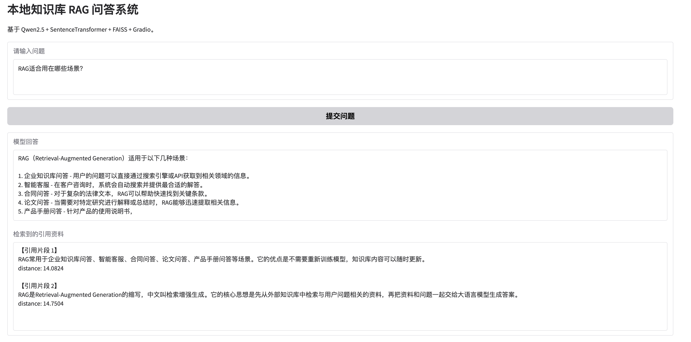

# 本地知识库 RAG 问答系统

## 项目介绍
这是一个基于大语言模型的知识库问答系统，使用 RAG（检索增强生成）方法，让模型先检索资料再回答问题，从而提高回答的准确性和可解释性。

## 技术栈
- Qwen2.5（大语言模型）
- SentenceTransformer（文本向量化）
- FAISS（向量检索）
- Gradio（前端界面）

## 实现流程
用户提问 → 向量化 → 相似度检索 → 文档召回 → Prompt构造 → 模型生成答案 → 展示引用来源

## 项目特点
- 实现完整 RAG 流程
- 支持中文问答
- 提供引用来源，降低模型幻觉
- 可扩展为企业知识库系统

## Demo截图

## 如何运行
在 Google Colab 中运行 notebook 文件即可。

